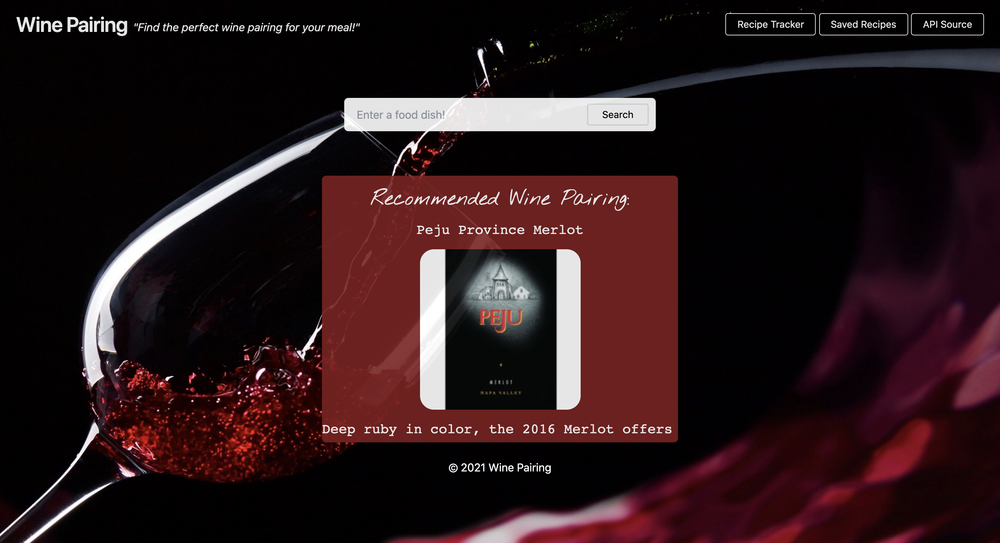

# Recipe Finder, Saver, and Wine Pairer! 

For our first bootcamp project, meant to help us showcase our skills in HTML, CSS (using a framework other than bootstrap !), and JavaScript. We brainstormed a little, and settled on the idea to make a recipe finder. 

The recipe finder serves as the first function, and the second aspect is a functionality that pairs a type  of wine that pairs very nicely with the dinner recipe selected. To top things off, the user is able to save their selected recipes to the local storage.

## Motivation

Our motivation was to create a functional as well as useful/practical web-app that satisfied the grading criteria, but that could also be actually used in the real-world. This was a challenging exercise that saw some issues come up, but learning JavaScript functions was also a motivator and Hayley did an amazing job at overcoming her issues to get the functions to work. Tommy also stepped up to the challenge of learning a new CSS framework, Tailwind. Through collective efforts, lots of new knowledge was gained, which on top of receiving a good grade, the learning aspect was also a huge motivation. 

## Build Status

Application is running, hosted on github. The link for the running app is: 

## Code Style 
The coding styles used are a combination of mostly, functional, and database programming styles. The functional aspect and whole basis of the project is to have two API's (the functions). The database programming is from having to get the API's to fetch data, log it, and then display it on the webpage.

## Screenshots/ Video/ How To Use

## Technology,  Script, and Framework Used
The project uses a dynamic structure of html, JavaScript, with event listeners, JSON, functions, and of course the use of our Spoonacular API's. And a new type of CSS framework , Tailwind for the styling and aesthetics. 

## Installation
In the event that you want to use the code yourself, follow these steps!
1. Navigate over to https://github.com/HayleyMcHugh/project-1 This is the repository where all the code for the project is.
2. Click on the green Code button, and copy the SSH key to your clipboard.
3. Open your terminal, make a new folder for this project, and clone the repository into your local storage.
4. Make sure you have a text editor, I reccommend Visual Studio Code. 
5. Once the repository has been cloned, use the command "code ." to open the project in your text editor.
6. All done ! Edit, experiment, and deploy as you wish. 

## API Reference
We employed the use of "Spoonacular" an API that boasts themselves on being "the only food API you'll ever need." The link to their homepage can be found here https://spoonacular.com/food-api . In order to access the recipe-finder as well as the wine-finder/wine-pairing API's, you'll need to create an account (free) with Spoonacular. They have a myriad of API's to choose from, the two that we selected are just a small fraction of what's available. 

### Credits & Contributors

Hayley McHugh

Erin Beniga 

Ricardo Crossley

Tommy La 

Google, Bootcamp, StackOverflow, Youtube. 

Our instructor Will Vasquez. 

Our TA Shazeen Fabius.